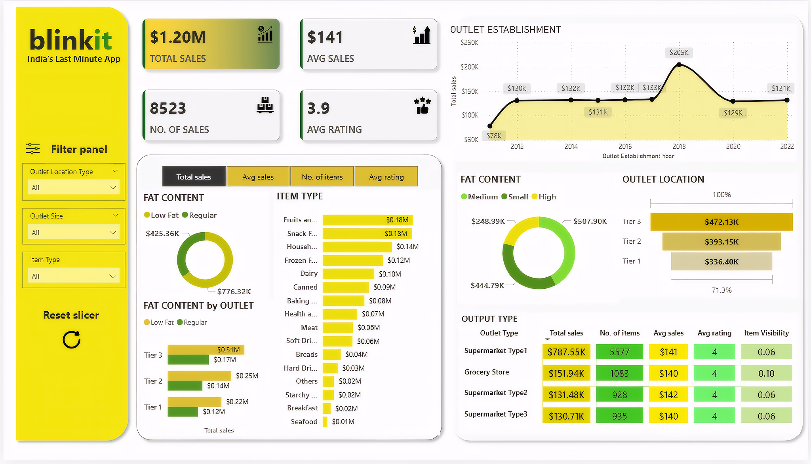

# BlinkIT-dashboard

## India's Last Minute App

### 1. Project Title

BlinkIT Insights: Grocery Sales & Outlet Performance Dashboard

An interactive Power BI dashboard built to analyze BlinkIT's grocery sales data — covering outlet performance, item categories, fat content trends, and regional distribution across India.

### 2. Problem Statement

As a Product Manager at BlinkIT, understanding which outlets, item categories, and locations drive the most sales is critical for making decisions on inventory allocation, outlet expansion, and category prioritization. With sales data scattered across 8,500+ transactions spanning multiple outlet types, sizes, and locations, it becomes difficult to quickly spot which segments are underperforming or which product categories deserve more shelf space. This dashboard was built to solve that problem — giving the product and business team a single view to track sales performance, outlet efficiency, and item-level trends without digging through raw data.

### 3. Tech Stack

The dashboard was built using the following tools and technologies: 
•	Power BI Desktop – Main data visualization platform used for report creation. 
•	Data Modeling – Relationships and calculated fields used to enable cross-filtering, KPI cards, and aggregation across outlet, item, and sales tables. 
•	File Format – .pbix for development and .png for dashboard previews.

### 4. Data Source

Source: [Kaggle – BlinkIT Grocery Data]([https://www.kaggle.com/](https://www.kaggle.com/datasets/mukeshgadri/blinkit-dataset))

Data on 8,523 grocery sales records from BlinkIT, including item details (fat content, item type, weight, visibility), outlet attributes (location tier, size, type, establishment year), and sales performance metrics (total sales, ratings).

### 5. Features

•	**Goal of the Dashboard**
To deliver an interactive visual tool that enables the product and business team to monitor sales performance across outlets and item categories. Supports decisions such as inventory planning, category prioritization, and outlet expansion strategy. Uncovers trends in fat content preference, item visibility, and outlet location tier performance.

•	**Walkthrough of Key Visuals**
- **Key KPIs (Top Left)**
  Total Sales: $1.20M
  Average Sales: $141
  Number of Sales: 8,523
  Average Rating: 3.9
- **Filter Panel**
  Interactive slicers for Outlet Location Type, Outlet Size, and Item Type let users drill into specific segments across all visuals.
- **Outlet Establishment (Line Chart)**
  Tracks total sales by the year outlets were established, highlighting a sharp peak around 2018 ($205K) followed by a decline.
- **Fat Content (Donut Chart)**
  Compares total sales between Low Fat ($776.32K) and Regular ($425.36K) items.
- **Item Type (Bar Chart)**
  Ranks item categories by total sales — Fruits and Vegetables and Snack Foods lead at $0.18M each, while Seafood and Breakfast trail behind.
- **Fat Content by Outlet Tier (Bar Chart)**
  Breaks down Low Fat vs. Regular sales across Tier 1, Tier 2, and Tier 3 outlets.
- **Outlet Location (Bar Chart)**
  Compares total sales across Tier 1 ($336.40K), Tier 2 ($393.15K), and Tier 3 ($472.13K) locations.
- **Outlet Type Table**
  Summarizes total sales, number of items, average sales, average rating, and item visibility by outlet type — Supermarket Type1 leads with $787.55K in sales.

•	**Business Impact & Insights**
Inventory Planning: The product team can prioritize shelf space for high-performing categories like Fruits and Vegetables and Snack Foods.
Outlet Strategy: Tier 3 outlets generate the highest sales, suggesting expansion opportunities in similar locations.
Category Positioning: Low Fat items outsell Regular items, hinting at a shift toward health-conscious consumer preference.
Performance Monitoring: Supermarket Type1 outlets significantly outperform other outlet types, useful for benchmarking underperforming formats.

### 6. Screenshots

